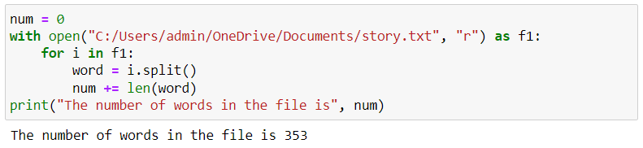

# Word-Count
## AIM:
To write a python program for getting the word count from a text.
## EQUIPEMENT'S REQUIRED: 
PC
Anaconda - Python 3.7
## ALGORITHM: 
### Step 1:
Initialize a variable num to store the count of words, set it to 0.
### Step 2: 
 Open the file "story.txt" in read mode.
### Step 3: 
Start a loop to iterate through each line in the file.
### Step 4:  
Within the loop, split each line into words using the split() method.
### Step 5: 
Add the count of words in each line to the num variable.
### Step 6: 
After the loop, print the value of num along with a message indicating the number of words.

## PROGRAM:
```
Program to find the word count from a text:
Register No: 212223100049
Developed By: S.Sajetha

num = 0
with open("C:/Users/admin/OneDrive/Documents/story.txt", "r") as f1:
    for i in f1:
        word = i.split()
        num += len(word)
print("The number of words in the file is", num)
```
### OUTPUT:



## RESULT:
Thus the program is written to find the word count from a text.
